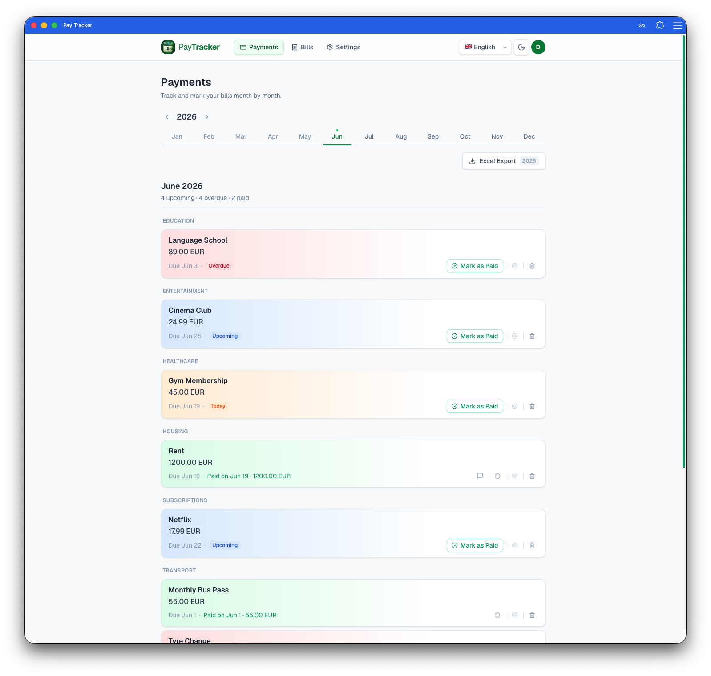
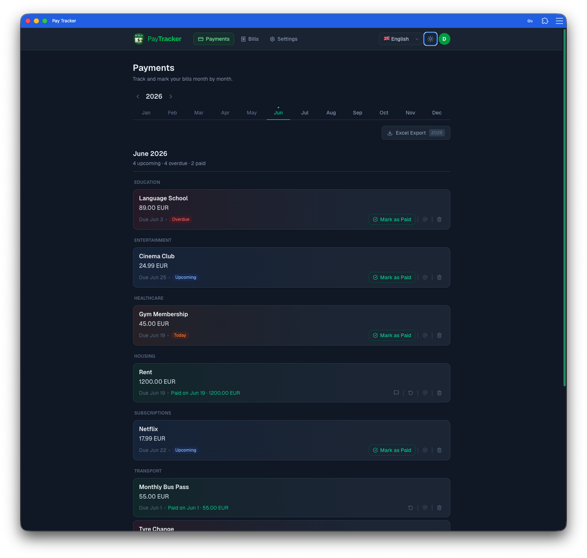
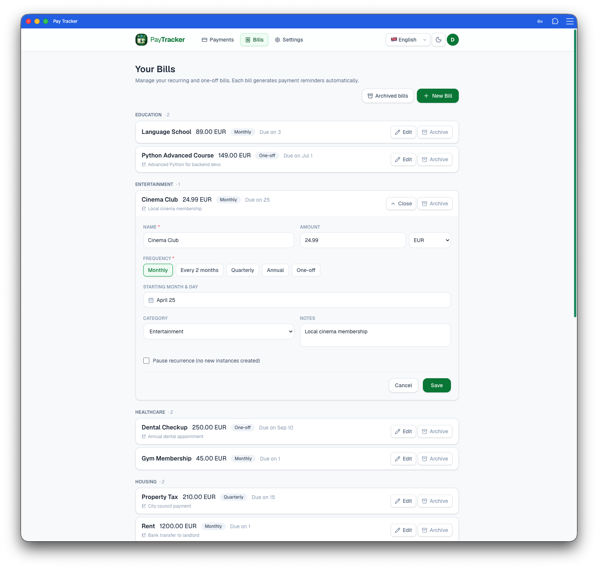
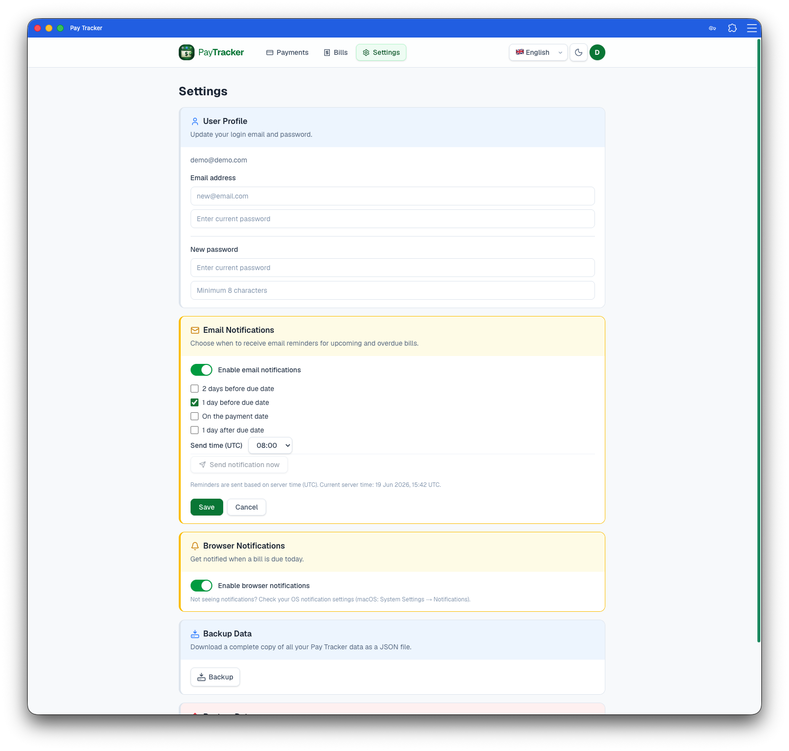

# Pay Tracker

A self-hosted household bill tracking PWA. Define your recurring bills once, then each month's payment instances are generated automatically. Mark bills paid from any device — phone, tablet, or desktop.

No third-party data sharing. No subscription. Runs locally with Docker Compose or in the cloud. Each user's data is fully isolated.


## Preview

| Payments (light) | Payments (dark) |
|---|---|
|  |  |

| Bills | Settings |
|---|---|
|  |  |


## What it does

- **Bill templates** — define a bill once: name, category, amount, currency, recurrence frequency, due day of month. Pay Tracker generates payment instances automatically each period.
- **Category grouping** — bills and payments are grouped under predefined category headers (Housing, Utilities, Insurance, Subscriptions, Entertainment, Transport, Healthcare, Education, Other). Category is required on every bill.
- **Payment tracking** — view upcoming, overdue, and paid bills for any month, grouped by category. Mark as paid with an optional amount override and note. Revert if you made a mistake.
- **Email reminders** — optional. Configure SMTP credentials and a send time (30-minute precision) and the app emails you before or after each bill's due date.
- **Email sent indicator** — each payment row shows an `@` icon: gray if no reminder has been sent, amber if one was sent. Click it to see the exact timestamp.
- **Export & backup** — download payment history as `.xlsx` (one sheet per month) or a full JSON backup. Restore from backup at any time.
- **Multilingual** — English, Polish, German. Language is saved per account.
- **Installable as PWA** — works offline-first on mobile and desktop.


## Getting started

### 1. Set up environment

```bash
cp .env.example .env
```

Edit `.env` and set a strong `JWT_SECRET`. Everything else works with the defaults for local use.

### 2. Start the app

```bash
docker compose up --build
```

- Frontend: http://localhost:3010
- API docs: http://localhost:8010/docs

### 3. Create your account

Open http://localhost:3010 and register. Each account is isolated — register separately for each family member.

### 4. Add your first bill

Go to **Bills → New Bill**. Fill in the name, category, amount, frequency, and due day of month. Save it — Pay Tracker will generate this month's payment instance automatically.

### 5. Track payments

Go to **Payments**. Use the month selector to browse any period. Click **Mark as Paid** when a bill is settled. The next month's instance is created automatically for recurring bills.

### 6. Set up email reminders (optional)

Add SMTP credentials to `.env` (see the `# Reminders` section in `.env.example`), then restart. Go to **Settings → Email Notifications** to configure when reminders are sent and which timing windows to use (2 days before, 1 day before, on the day, 1 day after).

The settings page also shows the current server time (UTC) so you can set the send time relative to your timezone.


## Environment variables

| Variable | Required | Description |
| --- | --- | --- |
| `JWT_SECRET` | yes | JWT signing secret — use a long random string |
| `DATABASE_URL` | yes | PostgreSQL connection string |
| `NEXT_PUBLIC_API_URL` | yes | Backend URL as seen by the browser |
| `SMTP_HOST` | no | SMTP server for email reminders |
| `SMTP_PORT` | no | SMTP port (default: 587) |
| `SMTP_USER` | no | SMTP login |
| `SMTP_PASSWORD` | no | SMTP password |
| `REMINDER_FROM` | no | From address for reminder emails |

Copy `.env.example` to `.env`. Never commit `.env`.


## Stack

- **Frontend:** Next.js 16 (App Router), React 19, TypeScript, Tailwind CSS, next-intl
- **Backend:** FastAPI, Python 3.13, SQLAlchemy 2.0, Alembic, Pydantic v2
- **Database:** PostgreSQL 17 (co-located in the backend container)
- **Runtime:** Docker Compose


## Development commands

```bash
# Start everything
docker compose up --build

# Wipe DB and start clean
docker compose down -v && docker compose up --build

# Frontend only (against a running backend)
cd frontend && npm run dev

# Backend only
cd backend && uv run uvicorn app.main:app --reload

# Lint
cd frontend && npm run lint

# Backend tests
cd backend && uv run pytest tests/ -v

# New DB migration after changing a model
docker compose exec backend uv run alembic revision --autogenerate -m "describe the change"
```

> **Migration note:** Always read the generated migration file before applying — autogenerate can miss new columns. For renames, write `add_column` + `UPDATE` + `drop_column` manually instead of relying on `alter_column(new_column_name=...)`.


## Installing as a PWA

- **Chrome / Brave (desktop):** install icon (⊕) in the address bar, or browser menu → Install Pay Tracker
- **Android:** browser menu (⋮) → Add to Home screen
- **iOS Safari:** Share (⎋) → Add to Home Screen

Requires HTTPS in production. Localhost works as an exception in most browsers.


## Export & backup

- **XLSX** — Payments page → Export Excel. One sheet per month, all columns.
- **JSON backup** — Settings → Download Backup. Full data export scoped to your account.
- **Restore** — Settings → Restore from Backup. Atomically replaces your data. Requires `schema_version: 2`.
